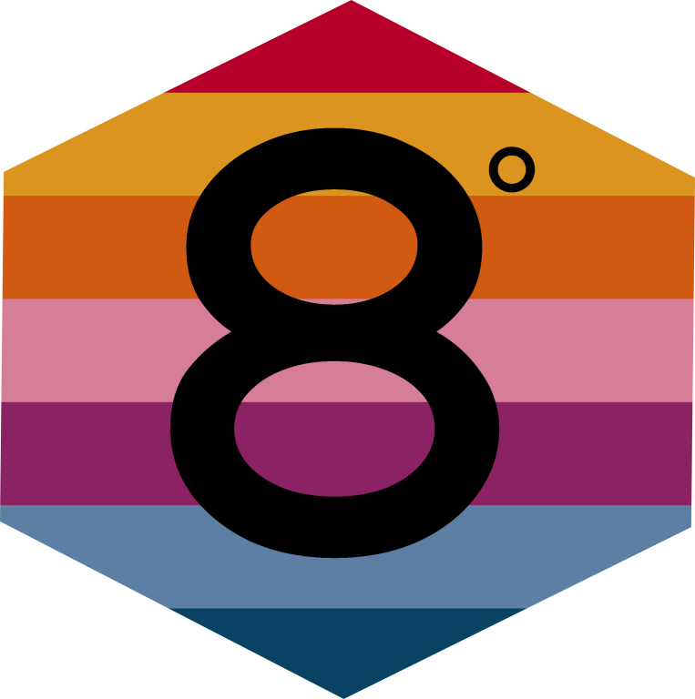
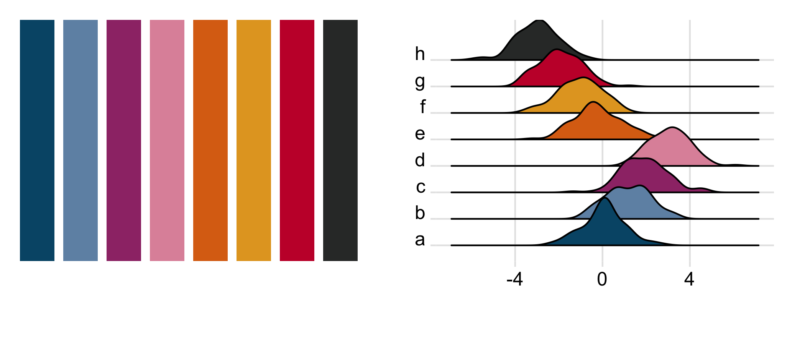
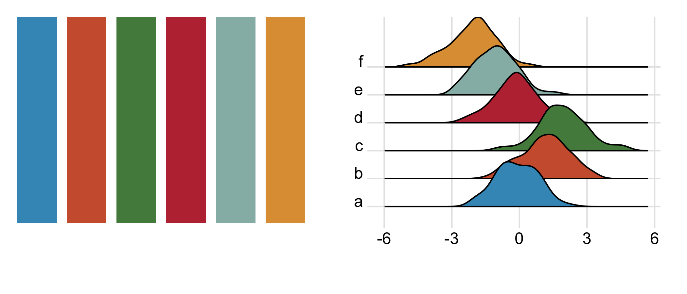
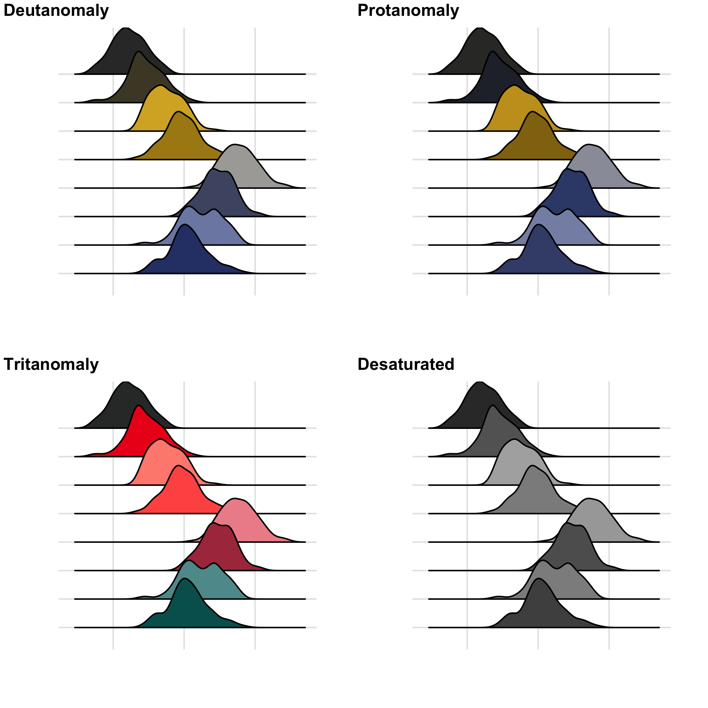

```{r setup, include=FALSE}
knitr::opts_chunk$set(echo = TRUE)
library(tidyverse)
library(colorblindr)
library(ggridges)
library(eightdegrees)
library(patchwork)
```


## Eight Degrees Brewing
[Eight Degrees Brewing](https://www.eightdegrees.ie/) are an Irish brewery in Cork. I was inspired by the colour palette of their limited edition, Munro series.  
    
Both scale_colour_* and scale_fill_* functions are included. The structure of this package is heavily inspired by the [{colorblindr}](https://github.com/clauswilke/colorblindr) `r emo::ji("package")`. 

### Munro Series
8 colour paired palettes based on the limited edition Munro series
```{r eval=FALSE}
colorblindr::gg_color_swatches(8)+scale_fill_munro()->p1

tibble(
  a=rnorm(100),b=rnorm(100,mean=1),c=rnorm(100,mean=2),d=rnorm(100,mean=3),
  e=rnorm(100),f=rnorm(100,mean=-1),g=rnorm(100,mean=-2),h=rnorm(100,mean=-3)
  )%>%
    pivot_longer(everything(),names_to="letters",values_to="values")%>%
    ggplot(aes(x=values,y=letters,fill=letters))+geom_density_ridges2()+
      scale_fill_munro(guide=NULL)+theme_ridges()+labs(y="",x="")->p2

p1+p2-> ppp
ggsave("pngs/munro.png",plot=ppp,height=3,width=7)
```


### Core Range
6 colour palette based on the core range from 8 degrees brewing
```{r eval=FALSE,fig.align='center',out.width="90%",fig.height=3}
colorblindr::gg_color_swatches(6)+scale_fill_core_range()->p3

tibble(
  a=rnorm(100),b=rnorm(100,mean=1),c=rnorm(100,mean=2),
  d=rnorm(100),e=rnorm(100,mean=-1),f=rnorm(100,mean=-2)
  )%>%
    pivot_longer(everything(),names_to="letters",values_to="values")%>%
    ggplot(aes(x=values,y=letters,fill=letters))+geom_density_ridges2()+
      scale_fill_core_range(guide=NULL)+theme_ridges()+labs(y="",x="")->p4

p3+p4 -> pp
ggsave("pngs/core_range.png",plot=pp,height=3,width=7)
```

  
*********
  
**Unfortunately these palettes are not colourblind safe**<br>
But if you request two colours from either palette the returned pair is a colourblind safe blue and orange. 
  

